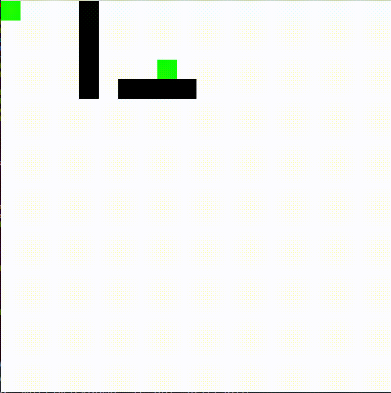

# A* algorithm

# Build

```

$ cd A_star
$ mkdir build && cd build
$ cmake ..
$ make
$ ./A_star -bfs

```

After this you should enter parameters of grid in this order:

1. width
2. number of obstacles
3. then enter integer coords of all obstacles
4. start point
5. end point

ex:

```
20  # grid size
1   # number of obstacles
5 5 # obstacle
0 0 # start
8 4 # end

```

# Essence of algorithm

A* is algorithm of searching path from point to point.

Key concept in A* is neighbors queue. We start with start point and push all its neighbors to the neighbors queue. This queue is queue with priorities. Priority can be computed as:

$Priority = cost_from_start + cost_to_end$

cost_from_start - distance from start, similar to distance in [Dijkstra algorithm](https://en.wikipedia.org/wiki/Dijkstra%27s_algorithm).

cost_to_end - estimation of cost of getting to the end from current point.

Varying formula for this priority we can give more benefit to some direction. Thus, get to the end faster than with algorithms that don't depend on end point (BFS, DFS, ...).

# Demos


BFS - priority queue turns into regular queue and all neighbors are equal:


Euclidean distance - give more benefit to points that are closer to end in euclidean meaning:




# Details

Grid is drawn with OpenGL.
You can move back and forward in the algorithm steps with RIGHT and LEFT buttons.

# Resources

[Nice introduction to A*](https://www.redblobgames.com/pathfinding/a-star/introduction.html)

[Wiki](https://en.wikipedia.org/wiki/A*_search_algorithm#)
